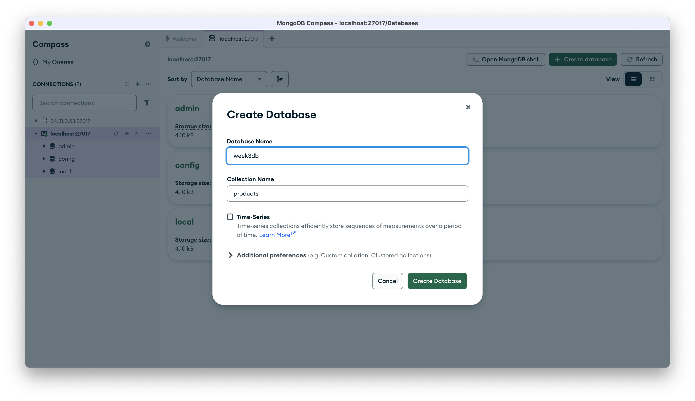
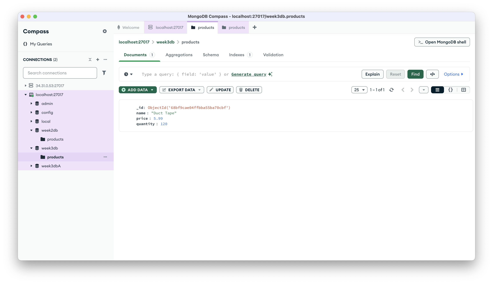
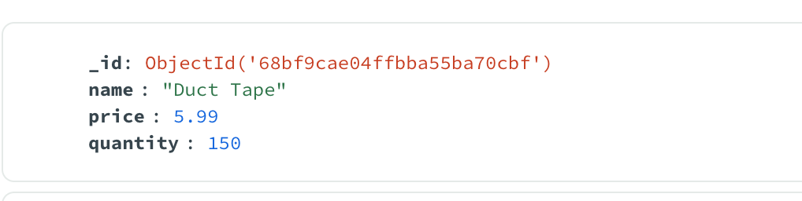
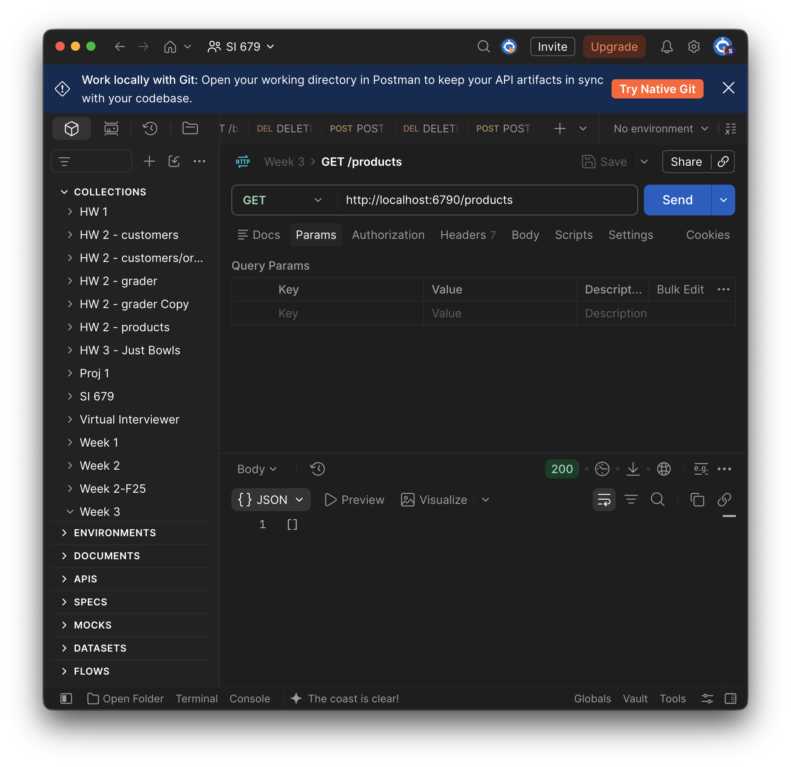
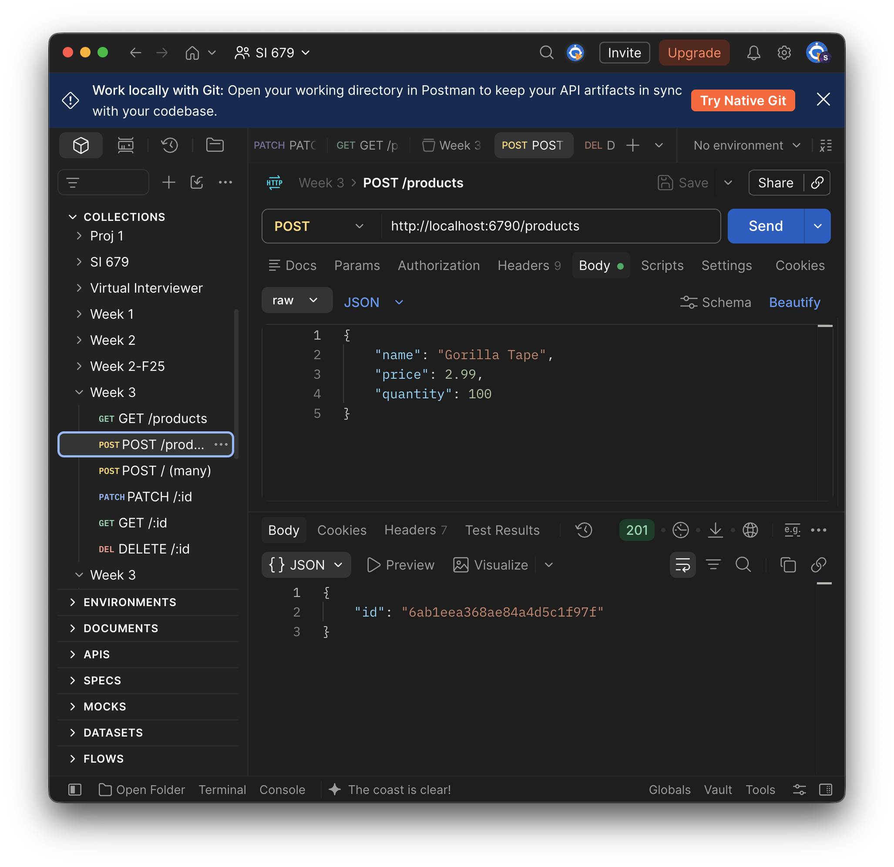
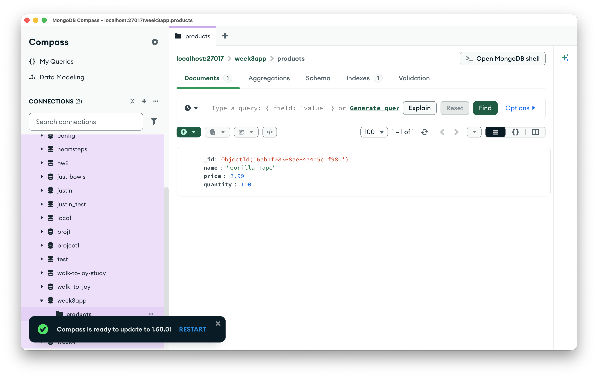
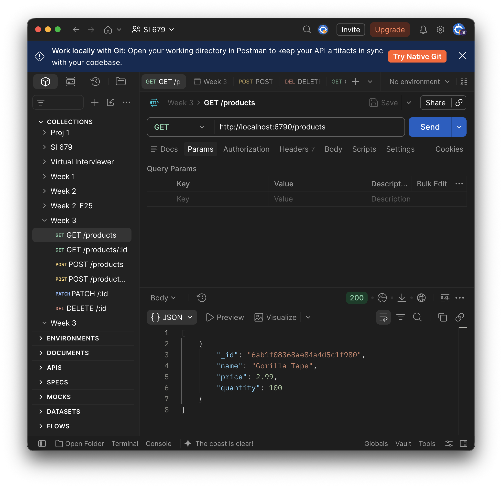
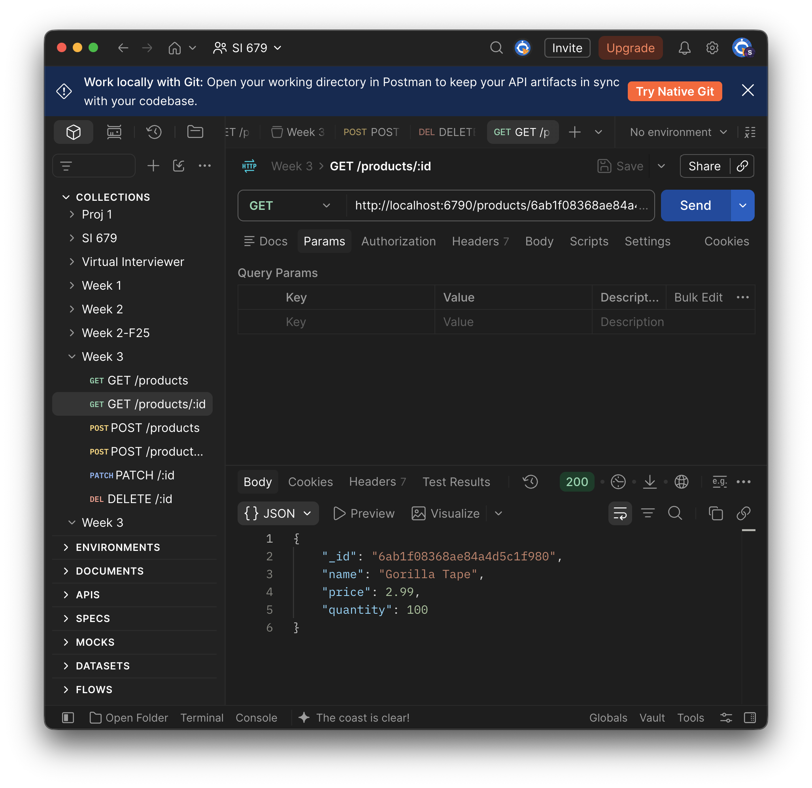
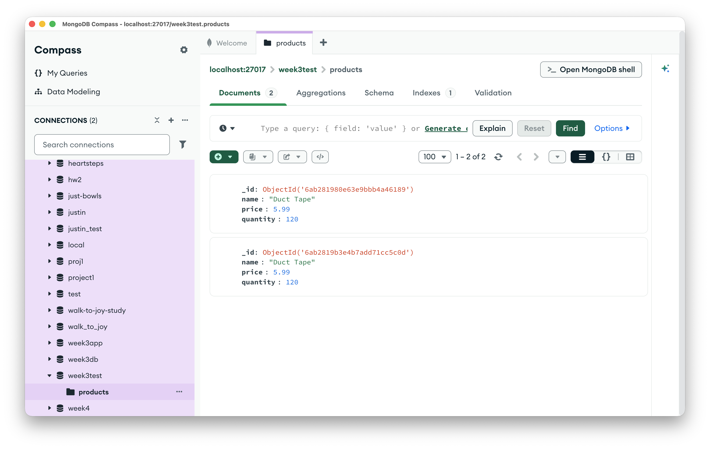

# Week 03 - Mongo DB

## Install Mongo DB

Hopefully you did this already. If not, head over to the [Week 3 prep page](/weeks/week03-mongo-integration/prep) and get going!

## Today's Goals

- Understand what NoSQL and Mongo are all about
- Get started working with Mongo through node and TypeScript
- Connect Mongo to Express
- Work with `expect()` and matchers in Vitest
- Use Supertest with MongoMemoryServer to test a mongo-backed HTTP API

## What is Mongo?

- Document-oriented NoSQL DB
- Supports “automatic replication and failover for high availability, native sharding for horizontal scalability, and tools for data security, management, and analytics.”
- 5th most popular DB in the world, most popular NoSQL DB
- Is available as a “self-managed” distribution or as a Database-as-a-service (MongoDB Atlas)

### NoSQL

Many of you have probably worked with SQL databases before. They’re great, and they are exactly what you need in lots of cases. They are particularly useful when you are dealing with data that is highly *relational*, that is lots of different concepts linked together that are needed to work in concert for your application.

Here is an example of a relational model for what appears to be a social networking application, that has been turned into a database model.


SQL databases make it relatively easy for you to specify these of relationships (e.g., all **Post**s have exactly one **creator** (who is a **User**) and a *Set* each of **likes, responses,** and **additional_viewers**. Each of these linked entity types (**Like, Response,** and **Additional_viewer**) have their own fields, including links to other entities, and so forth.

SQL databases also give you a handy language for getting relational data out of a database efficiently and concisely, by issuing queries like

```sql
SELECT *
FROM ChatMessage
JOIN User
  ON speaker = User.id
  WHERE User.name = "Mark"
```

But for some applications, SQL is overkill. There are three main arguments that are usually advanced for using NoSQL over SQL: scalability, flexibility, and simplicity.

- **Scalability** means it is easier to redistribute a NoSQL database over different physical machines once the data gets too big to fit on whatever machines it used to fit on. Since the different batches of data are purposefully set up to be unrelated, there are fewer constraints on where you can move different parts of the database if it turns out you need to. In the era of “Big Data” this often ends up being a Big Deal for certain applications.
- **Flexibility** means that you can more easily change your mind about how the data is modeled and stored. With SQL, you have to define the data model (i.e., the tables, rows, primary keys, foreign keys, etc.) up front and it can be very cumbersome to redefine the model once you’ve started building significant chunks of your application. Many NoSQL databases basically store all of the data as JSON objects. Changing how you want to represent your data is as easy as changing the format of the JSON objects (or Python/JavaScript objects, which already map nicely onto JSON) you produce. That’s not necessarily effort-free, but it’s generally less effort than “migrating the database” which is what often needs to happen  if you change the design of a SQL database that already has data in it.
- **Simplicity** is the third advantage claimed for NoSQL. If you know JSON, you know NoSQL. And everyone knows JSON nowadays, right? No special skills (e.g., writing SQL statements) required!

### Document-Oriented NoSQL

Document-oriented databases like MongoDB are organized into *Collections* of *Documents.* The *Documents* consist of *Fields,* which are sets of *Key-Value pairs.* Each of these elements more or less correspond to elements of SQL databases. While these elements operate differently, when thinking about designing data models it is useful to think of using NoSQL *Collections* where you would use a SQL *Table,* using a *Document* to represent individual records, as you would with a SQL *Row,* and using *Fields* to represent individual attributes of those records, as you would with a SQL *Column.*


### Data Types

Mongo internally stores Documents in BSON, which is an awkward acronym for “Binary JSON”. Unlike regular JSON, which represents all data as strings for maximum portability, BSON supports a number of data types. [Take a look](https://www.mongodb.com/docs/manual/reference/bson-types/). Most of these will be familiar, but some like ‘javascript’ and ‘regex’ are kind of interesting.

Since you will likely be interacting with Mongo via JavaScript you will not need to worry too much about these as the Mongo node library (or other libraries you may use in the future) will automatically handle translations between JavaScript and Mongo types. If you are interacting with Mongo directly through `mongosh` or MongoDB Compass, however, you might need to work more directly with these types, for better or worse.

Note that two of the data types in Mongo/BSON are “array” and “object”, which have more or less the same meaning as they do in JavaScript, which means that you can have arbitrarily nested data structures within Mongo Documents that include lists of objects, objects containing lists, lists of lists, etc.

While *values* in BSON can be of various Data Types, *keys* or *field names* must always be strings. This is similar to JavaScript, though JS also allows keys to be Symbols, which are unique identifiers created by the `Symbol()` constructor. JS will allow to use other data types (e.g., integers) as keys, but they are implicitly converted to strings.

## Using MongoDB

### Create a Database

Before interacting with Mongo via code, you will need to create at least one database using either Compass or `mongosh`.

Via Compass:



Via `mongosh`:

```bash
$ mongosh
test> use week3db
switched to db week3db
week3db> db.createCollection("products")
{ ok: 1 }
week3db> show databases
admin     40.00 KiB
config    72.00 KiB
local     40.00 KiB
week3db    8.00 KiB
```

Do this with Compass or mongosh.
You do not need to create any documents yet.

### Start with the Starter

For our code-along today we'll use a starter repo that you'll get by [accepting the Week 3 NYT assignment](https://classroom50.org/SI679-Classroom-F26/si-679-f-26/assignments/week03-nyt/accept?k=mjt5rszh). Clone the resulting repo and run `npm install`. FYI there is an autograder test that should always pass, so you just need to push at least one commit before 6pm to get credit for today's NYT.

Note that all of today's code was tested using node version 24.21.0. Likely everything will work fine with anything close to this (say, 22+?), but if you have something really old (say, <20?), you should upgrade. If you're not sure how to do that, talk to José.

After `npm install`, everything we need is installed, the node `mongodb` package included, and there is a run script ready for this part of the lecture. Create an empty file, `src/db-explore.ts`, then start it:

```bash
npm run explore
```

That runs `src/db-explore.ts` with `tsx watch`, and runs it again every time
you save. Leave it going in a terminal for the rest of this section. (If you're curious, you can see how the starter was put together in its `SETUP.md`.)

### Connect to MongoDB

Next we will connect to Mongo and test the connection. For this we will need the URI to our running instance of Mongo (not running? see [Start the server](/weeks/week03-mongo-integration/prep#_3-start-the-server)). If you’ve followed all of the prep & lecture instructions so far, your URI will be the default, which is `mongodb://127.0.0.1:27017`. We will save a reference to the MongoClient we create, as well as the specific DB we will be using.

```ts
import { MongoClient } from 'mongodb';
import type { Db, Document } from 'mongodb';
```

<<< ../../../code/week03-mongo-integration/week03-lecture/src/db-explore.ts#connect{ts}

Create a `main()` function at the bottom then call it.

```ts
const main = async () => {
  await connect();

  // test connection
  await db.command({ ping: 1 });
  console.log('client is connected');

  await disconnect();
};

main();
```

Note the second import line. `Db` and `Document` are *types*: they exist only
for TypeScript and disappear when the code runs, so our `tsconfig.json` makes
us import them with `import type`. We'll use `Document` shortly.

If all is well you should see something like:

```text
client is connected
```

### Add a Document

<<< ../../../code/week03-mongo-integration/week03-lecture/src/db-explore.ts#testAdd{ts}

```ts
const main = async () => {
  await connect();

  const result = await testAdd();
  console.log(result);

  await disconnect();
};

main();
```

You should see this in your console:

```text
{
  acknowledged: true,
  insertedId: new ObjectId('68bf9cae04ffbba55ba70cbf')
}
```

And this in Compass:



Or this in `mongosh`:

```text
week3db> db.products.find()
[
  {
    _id: ObjectId('68bf9cae04ffbba55ba70cbf'),
    name: 'Duct Tape',
    price: 5.99,
    quantity: 120
  }
]
```

### Add Several Documents

… using `insertMany()`

<<< ../../../code/week03-mongo-integration/week03-lecture/src/db-explore.ts#testAddMany{ts}

Now test it.

```ts
const main = async () => {
  await connect();

  const result = await testAddMany();
  console.log(result);

  await disconnect();
};

main();
```

You should see

```text
{
  acknowledged: true,
  insertedCount: 2,
  insertedIds: {
    '0': new ObjectId('68bf9f42d0eabc55610c1ab3'),
    '1': new ObjectId('68bf9f42d0eabc55610c1ab4')
  }
}
```

### Find All Documents

If you call `collection(NAME).find()` (i.e with no arguments), it will return all of the documents in that collection. Or rather it will return a `Cursor`, which is an iterable object that will give you access to all of the items.  Here we iterate through all of the results and build an array that we return from `getAllTest()`. The `if (doc)` is for TypeScript's benefit: as far as it knows, `cursor.next()` might come back `null`, and with `strict` on it won't let us push a possibly-`null` value into an array of `Document`s.

<<< ../../../code/week03-mongo-integration/week03-lecture/src/db-explore.ts#getAllTest{ts}

Now try that out.

```ts
const main = async () => {
  await connect();

  const results = await getAllTest();
  console.log(results);

  await disconnect();
};

main();
```

### Find One Document by `name`

MongoDB supports a rich toolbox of query options, which we will see more of later. Queries are defined as objects, where the query object keys represent the fields to match in the queried documents, and the query object values represent the document values to match.

```ts
const findOneTest = async () => {
  const oneResult = await db.collection('products').findOne({
    name: 'Duct Tape'
  });
  return oneResult;
};
```

Try it out! Note here that if more than one Document matches the query, only the first match (whatever mongo considers that to be) will be returned by `findOne()`.

```ts
const main = async () => {
  await connect();

  const result = await findOneTest();
  console.log(result);

  await disconnect();
};

main();
```

Which should yield:

```text
{
  _id: new ObjectId('68bf9cae04ffbba55ba70cbf'),
  name: 'Duct Tape',
  price: 5.99,
  quantity: 120
}
```

### Find by `_id`

One of the most common ways you’ll want to retrieve documents is using their `_id`. This is the internal ID that is assigned by Mongo (unless you provide one, which you can do but generally would not want to do). The type of `_id` is `mongodb.ObjectId`, which you will need to `import` before you use it.

So at the top of your `db-explore.ts`, add it:

<<< ../../../code/week03-mongo-integration/week03-lecture/src/db-explore.ts#imports{ts}

And then copy the line from your terminal that looks like this (note that this will not work if you use my ID!):

```text
_id: new ObjectId('68bf9cae04ffbba55ba70cbf'),
```

And paste that line (your line, not mine!) into your `findOneTest()` function, replacing the line `name: 'Duct Tape'`:

<<< ../../../code/week03-mongo-integration/week03-lecture/src/db-explore.ts#findOneTest{ts}

Which should print out the same as last time:

```text
{
  _id: new ObjectId('68bf9cae04ffbba55ba70cbf'),
  name: 'Duct Tape',
  price: 5.99,
  quantity: 120
}
```

### Work with Queries

Mongo queries are composed by constructing objects, as we’ve seen above. The queries we just ran implicitly specified an “equals” query operation (as in `name == "Duct Tape"` or `_id == new ObjectId('68bf9cae04ffbba55ba70cbf')`), but you can specify other constraints such as “less than” (`$lt`), “greater than or equal to” (`$gte`), and so forth. You can check out [a more complete set of query operators](https://www.w3schools.com/mongodb/mongodb_query_operators.php) if you’d like. Here’s an example of a query for all products that cost less than $5.00:

<<< ../../../code/week03-mongo-integration/week03-lecture/src/db-explore.ts#findManyTest{ts}

Try that out:

```ts
const main = async () => {
  await connect();

  const result = await findManyTest();
  console.log(result);

  await disconnect();
};

main();
```

You should see

```text
[
  {
    _id: new ObjectId('68bf9f42d0eabc55610c1ab3'),
    name: 'Scotch Tape',
    price: 3.99,
    quantity: 100
  },
  {
    _id: new ObjectId('68bf9f42d0eabc55610c1ab4'),
    name: 'Masking Tape',
    price: 2.01,
    quantity: 77
  }
]
```

### Update a Document

To update a document, you need to specify a query *and* an update operation. The update operation will be applied to the matched record(s) (“first” one if using `updateOne()`, or all matches if using `updateMany()`).  The update operation must be an object that has an *update operator* as its (first and only?) property, and with a value that specifies the change to be made. In the case of the `$set` operator used in this example, the value of the `$set` property is another object specifying the fields to update and their new value. For other operators like `$inc` the value would have a different format (i.e., a number indicating how much to increment). Check out the [full set of update operators](https://www.mongodb.com/docs/manual/reference/mql/update/#std-label-update-operators) so you know what’s possible in the future.

<<< ../../../code/week03-mongo-integration/week03-lecture/src/db-explore.ts#updateOneTest{ts}

Note that for update and delete operations (coming shortly), you would almost never want to use a query like `{ name: 'Duct Tape' }` because it could match several documents and it would update/delete them all. We are only doing it this way as a lecture example to illustrate how queries work together with update (and, soon, delete) operations.

Try it.

```ts
const main = async () => {
  await connect();

  const result = await updateOneTest();
  console.log(result);

  await disconnect();
};

main();
```

The result tells us what was done (in particular the modifiedCount tells you that the operation succeeded), but doesn’t show us the modified record…

```text
{
  acknowledged: true,
  modifiedCount: 1,
  upsertedId: null,
  upsertedCount: 0,
  matchedCount: 1
}
```

You should be able to see it in Compass, though (use Cmd-R/Ctrl-R to force Compass to refresh)…



There are other variants of update, including `updateMany()` and `replaceOne()` and you can probably guess what they do. Read the docs if you want to use these, or also if you want to apply options to your update calls (passed as the third argument to `updateOne()`), such as `{upsert: true}`.

### Delete a Document

To delete a document, provide a query. For `deleteOne()`, the first matching document will be deleted, and for `deleteMany()`, all of them will. Careful!

<<< ../../../code/week03-mongo-integration/week03-lecture/src/db-explore.ts#deleteOneTest{ts}

Try it.

```ts
const main = async () => {
  await connect();

  const result = await deleteOneTest();
  console.log(result);

  await disconnect();
};

main();
```

The result of `deleteOne()` tells you what happened:

```text
{ acknowledged: true, deletedCount: 1 }
```

## Now You Try #1

::: tip Lost? Catch up here
Copy [`src/db-explore.ts`](https://github.com/SI679-public/SI679-public.github.io/blob/main/code/week03-mongo-integration/week03-lecture/src/db-explore.ts)
from the finished lecture code into your project, replacing yours.
:::

Each of these is a small variation on a function we wrote above. Verify each one with `getAllTest()` or in Compass.

- write a function `findPricierTest()` that finds every product that costs $5 or more.
- write a function `updatePriceTest()` that changes the price of Scotch Tape to $4.29.
- write a function `deleteByNameTest()` that deletes Masking Tape, finding it by name rather than by `_id`.
- (stretch) write a function `markOnSaleTest()` that uses `updateMany()` to add a field `onSale: true` to every product that costs less than $5. Take a look in Compass afterwards: those documents now have a field the others don't.

Lecture code with Now You Try solution can be found at https://github.com/SI679-public/SI679-public.github.io/tree/main/code/week03-mongo-integration/week03-nyt-solution. Look at the bottom of db-explore.ts for the NYT #1 solutions.

## Announcements

- HW 1 was due last night. Hopefully that is not news to you.
- (Almost) all assignments are now set up on Canvas with release dates and due dates, so you can get a sense of what the semester schedule looks like from that perspective. If you see something that looks fishy let me know. It's very easy to make mistakes on Canvas.

## Using Mongo with Express

In the examples above, we hard-coded all of the operations to get familiar with Mongo. But of course, that’s not how we would build an app. Let’s start to look at how we might use Express and Mongo to build a database-backed API that will support basic CRUD operations.

First, we will create a set of more general functions for managing the `products` collection. Create the file `db.ts` in your `src/` directory with the contents we will build now, step by step:

First we import what we need from `mongodb` and define our types. Note that `Product` and `ProductUpdate` are the same, except in the latter all the fields are optional.

<<< ../../../code/week03-mongo-integration/week03-lecture/src/db.ts#types{ts}

An alternative to

```ts
  export interface ProductUpdate {
    name?: string;
    price?: number;
    quantity?: number;
  }
```

is

```ts
  export type ProductUpdate = Partial<Product>;
```

which does the same thing - makes all of the fields in `Product` optional. `Partial<>` is an example of a [TypeScript Utility Type](https://www.typescriptlang.org/docs/handbook/utility-types.html), of which there are several. We won't expect you to use them and generally won't use them in lectures or HW starters (unless it would be really painful to avoid them), but you might see them in HW solutions and you will definitely see them if you go deeper into TypeScript or look for examples online.

Then add connect() and disconnect(). Note that `connect()` takes the `uri` and `dbName` as arguments--this also supports testing, since we'll use different URIs (and probably dbs) for testing and deployment.

<<< ../../../code/week03-mongo-integration/week03-lecture/src/db.ts#connect{ts}

Then add our getters,

<<< ../../../code/week03-mongo-integration/week03-lecture/src/db.ts#read{ts}

...and fill in the rest of the CRUD functions.

<<< ../../../code/week03-mongo-integration/week03-lecture/src/db.ts#write{ts}

Finally, a `_clearProducts()` helper for testing. We'll see how this is used a bit later.

<<< ../../../code/week03-mongo-integration/week03-lecture/src/db.ts#clear{ts}

On top of those database functions, we will layer a router that provides access to the key CRUD operations (CRUD stands for "Create, Read, Update, Delete" as you likely know already). Put this code in `src/product-router.ts`.

Now we build the routes, starting with the frontmatter...

<<< ../../../code/week03-mongo-integration/week03-lecture/src/product-router.ts#setup{ts}

And then our first route...

<<< ../../../code/week03-mongo-integration/week03-lecture/src/product-router.ts#getAll{ts}

To see this in action, we need to wire the route into the app

<<< ../../../code/week03-mongo-integration/week03-lecture/src/app.ts{ts}

And wire the app into the server. Note that we connect the DB before we start the server. Why might that be? Note also that we do NOT connect to the db in app.ts, and this, again, is for testability. We will deal with db connections differently for testing, but we want everything else in the app to work the same.

<<< ../../../code/week03-mongo-integration/week03-lecture/src/index.ts{ts}

Now we test. In Postman, create a GET request for /products, which should return all products. Likely this is an empty array, but if you have stuff in your DB there might be something there.



Write the GET for a single product

<<< ../../../code/week03-mongo-integration/week03-lecture/src/product-router.ts#getOne{ts}

Can't really test this yet until we get something in there, so let's add a POST route.

<<< ../../../code/week03-mongo-integration/week03-lecture/src/product-router.ts#post{ts}

Now test this in Postman:



Check Compass to verify the new product was created:



And then test your GET again, along with `GET /products/:id` (grabbing the ID from either your POST or your GET all request):





And finally, implement PATCH and DELETE.  We're now CRUD complete!

<<< ../../../code/week03-mongo-integration/week03-lecture/src/product-router.ts#patchDelete{ts}

## Testing the Routes

Now we will ditch Postman and turn to `vitest` with `supertest` to automate our testing. We'll start by testing against the live MongoDB, but quickly shift to using MongoMemoryServer which gives us more control over our tests and also keeps our test data from junking up our database. Keeping junk out of the database is obviously pretty important once you start dealing with real production data.

### Tests Against the Live Database

Create a new file `src/__tests__/products.test.ts` and add the following contents. Note that we connect to the DB at the top of the file and use that for the test that follows. We use a separate `week3test` database, so the products you created in Postman don't get in the way.

<<< ../../../code/week03-mongo-integration/week03-lecture/src/__tests__/01-live-db.stage.ts#stage{ts}

Let's digress slightly to talk about the `expect()` statements used in this test, since we glossed over these last week. Those are:

`expect(created.status).toBe(201);`

`expect(created.body.id).toMatch(/^[0-9a-f]{24}$/);`

`expect(all.body).toHaveLength(1);`

One nice thing about `expect()` statements in vitest and jest (recall that `jest` is the GOAT JS testing library from which `vitest` gets most of its mojo) is that they're kind of easy to read. `expect(foo).toBe(bar)` means, of course, that you're expecting foo to be exactly the same as bar. If it's not, the expectation is violated and the test fails. `toBe()` works fine for strings and numbers, but will often fail if you're comparing objects (for this use `toEqual()`, which we will touch on later). `expect(blah).toMatch(regex)` uses regular expressions--in this case it's looking for a string of exactly 24 hexadecimal characters (the digits 0–9 and the lowercase letters a–f)--the precise format of a Mongo-generated `_id`. And `expect(theArray).toHaveLength(n)` checks the length of an array.

These are some of the more useful "matchers" you'll use in vitest, and we'll see others as we need them. Going through every vitest matcher (there are many!) would be a waste of our time together, so keep the [Vitest Matchers Guide](https://vitest.dev/guide/learn/matchers) handy, or ask your favorite search engine/agent how to test for whatever you're trying to test for.

OK, now run that test: `npm test`. Yay! It passes!

Run it again. Dang! What happened?

Take a look in Compass:



What's happening, of course, is that every time we run the test we are creating a new "Duct Tape" product entry and these pile up. So that when the test runs `expect(all.body).toHaveLength(1);` the second time it fails because `request(app).get('/products')` returns all of the products that have been created up to that point.

We could solve this a few different ways, starting with calling `_clearProducts()` in `db.ts`, but at a certain point you probably DON'T want to delete all the products from your database. The sales team might have a few things to say to you at that point.

### MongoMemoryServer

MongoMemoryServer is a testing package that looks, smells, and feels just like a Mongo DB to your code. And technically it is one, but it writes all its data to a temp file that it deletes after every run. It spins up for testing and shuts down when testing is done, leaving no trace that it was ever there.

When it spins up, it exposes a URI just like a real mongo DB (similar to `mongodb://127.0.0.1:27017` but, for obvious reasons, different), which totally fools the node `mongodb` package into thinking there's a real database to write to and read from.

Rewrite `products.test.ts` to use MongoMemoryServer.

<<< ../../../code/week03-mongo-integration/week03-lecture/src/__tests__/02-memory-server.stage.ts#post{ts}

When you run your first test with MongoMemoryServer, it will download a copy of MongoDB Community Edition to your machine, just like you did when you were preparing for class. That took a while didn't it? So don't be surprised if your first test run takes some time.

Go ahead and run `npm test`. Then run it again, and notice:

- the second time was faster
- both runs succeeded

Now add a GET test, after the first:

<<< ../../../code/week03-mongo-integration/week03-lecture/src/__tests__/02-memory-server.stage.ts#startsEmpty{ts}

The POST test still passes but the GET test fails, even though it looks like it should pass, right?

We've run into the "dirty database" problem again, only this time within a single test suite. The reason, of course, is that the POST test, which runs first, leaves its detritus in the DB. Even though this will be cleaned up when the test run finishes (because that's how MongoMemoryServer works), we still have the problem that tests *within* a test suite can interfere with each other.

To address this, `vitest` offers `before` and `after` hooks for making sure that things start out in a known state for each test, as well as for the test suite as a whole. Those hooks are:

| Hook | Description |
| ---- | ----------- |
| `beforeAll()` | runs before the first test in a block (i.e., a test file/suite or a single `describe()` block). Used for setting things up you'll need for all the tests. |
| `afterAll()` | runs after the last test in a block (i.e., a test file/suite or a single `describe()` block). Used for tearing things down that were set up in `beforeAll()` |
| `beforeEach()` | runs before *each* test in the block. Used for ensuring the test environment is in a known state before running each test. |
| `afterEach()` | runs after *each* test in the block, restoring the environment to its previous state for other tests |

In our rewrite of `products.test.ts` we will move the initialization of MongoMemoryServer into `beforeAll()`, since it will be needed for all the tests in the suite. We will also clean up after ourselves by adding teardown into `afterAll()`. We will also add a call to `_clearProducts()` into `beforeEach()` so that every test will start with a clean slate.

<<< ../../../code/week03-mongo-integration/week03-lecture/src/__tests__/products.test.ts#setup{ts}

The two tests remain the same, only now they both pass because they are starting from a clean, known state. Note that in this case you could just as easily put the call to `_clearProducts()` in an `afterEach`--whatever makes the most sense to you would be fine (not always, but in this case).

### More Matchers

A bit more discussion of matchers is in order. Look at this, more detailed test of `GET /products`:

<<< ../../../code/week03-mongo-integration/week03-lecture/src/__tests__/products.test.ts#listsWhatWasAdded{ts}

We looked at `toBe` before, which tests if two things are *exactly the same thing*. This works for, say, testing a number against a constant that is also a number, but won't work for JS/TS Objects that have the same fields but were created separately. `toEqual` recursively tests the fields of an object to determine if the two things are logically the same, even if they were born at different times and in different places. TL;DR: use `toEqual()` (or its variants like `toStrictEqual()`) for objects and `toBe()` for primitives.

This snippet also illustrates `.toContain()`, which tests whether an array contains the argument passed in, and the use of `.not.`, which simply inverts the result of whatever comes after it. Note that `.toContain()` compares with `===`, like `toBe`, so it works for strings and numbers but not for objects; to check that an array holds an object with certain contents, use `.toContainEqual()`.

Other matchers that will likely be on your shortlist include `toBeUndefined()` and  `toThrow()` (or for testing async functions `await expect(thing_that_returns_a_promise).rejects.toThrow()`).

## Now You Try #2

::: tip Need to catch up?
Copy `src/db.ts`, `src/product-router.ts`, `src/app.ts`, `src/index.ts` and
`src/__tests__/products.test.ts` from `week03-lecture` into your code. Test to make sure it's all wired up correctly.
:::

- write a test for PATCH. Make sure that a "valid" ID (24-char hex string) that doesn't exist returns a 404 and that a successful request only updates the specified fields and doesn't change the others. (side quest: what happens when you try to supply a malformed ID like "badID123"?)
- write a test for DELETE. Be sure to test for both 404 and 200.
- (stretch) use middleware to check if a provided ID is the correct format for a mongo-generated ID (24 hexadecimal characters: the digits 0–9 and the lowercase letters a–f). Determine which HTTP status should be returned if it's not, return that, and add tests to verify that the middleware works for all affected routes.

Lecture code with Now You Try solution can be found at https://github.com/SI679-public/SI679-public.github.io/tree/main/code/week03-mongo-integration/week03-nyt-solution. The NYT #2 tests are in `src/__tests__/products-changes.test.ts`; for the stretch, look at `src/validate-id.ts` and where it's used in `src/product-router.ts`.
