# Week 04 · REST APIs

## This week's goals

- Understand REST architectural patterns
- Gain experience with REST patterns by building some routes
- Write and run tests using supertest and MongoMemoryServer

::: tip What happened to the end of week 3
We stopped last week just before MongoMemoryServer, and we still need to cover how that's used for testing. They are on this page rather than back on week 3's: the ideas are the same, and they fit even better into the app we are about to build. We will return to these ideas in the 2nd half of today's lecture.
:::

## REST APIs

We’ve been looking at how to declare routes and implement their handlers, along with middleware, error handling and so forth. Last week we looked at Mongo and started to look at how to hook Express up to Mongo.

But what makes for a GOOD server design? One in which the routes and how to use them is relatively clear and obvious to the seasoned developer, thus reducing the need for documentation and the likelihood of errors and frustration?

The principled approach to server design, or more specifically to API design, that has won the hearts and minds of most backend developers since its introduction in 2000 is referred to as REST. APIs that adhere to (at least some of) the principles of REST are referred to as RESTful APIs.

REST is an acronym for REpresentational State Transfer, and, according to Roy Fielding who initially defined and described REST in his 2000 dissertation at UC Irvine, REST encompasses 6 principles:

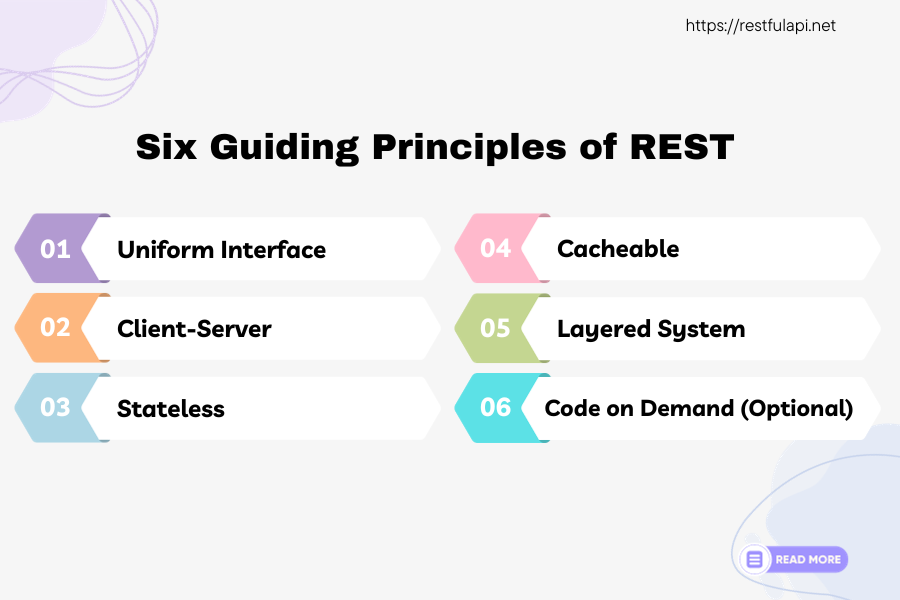

::: details The six principles in full

1. **Uniform Interface:** at a high level, this means that there needs to be a consistent and uniform interface for interactions between clients and servers. Using standard HTTP methods (GET, POST, DELETE, …) in standard ways helps with this, as does good , consistent naming of endpoints and so forth.
2. **Client-server:** this design pattern enforces separation of concerns, which makes it easier for server and clients to evolve independently from each other, and makes each easier to build and maintain than if they were intermingled.
3. **Stateless:** each request from the client must contain all of the information necessary to complete the request. There is no context maintained by the server that spans sessions.
4. **Cacheable:** responses should communicate whether or not they can be cached and used later. In my experience, this constraint is not consistently implemented in RESTful APIs and there are some hard challenges in doing this well.
5. **Layered system:** system architecture uses layers to further separate concerns and improve robustness, maintainability, and understandability. Various design patterns exist for this such as MVC, three-tiered designs, etc. We will look a common layered pattern for express called the Controller-Service pattern today.
6. **Code on Demand (Optional):** This one was a surprise to me! This criterion, which is explicitly labelled as “optional” allows servers to provide *code* that clients can execute. I don’t think this criterion is implemented very often, as it raises considerable questions regarding common execution environments and security.
:::

REST won because it fits HTTP, which is already stateless and client-server, and because its competition (SOAP, CORBA) was enormous and painful. The one idea worth carrying into today: what a server sends a client is a **representation** of a resource, not the resource itself. The server keeps the thing.

::: details The longer version — why REST won, and what "representational" means
The primary reason for the success of REST, however, is that these principles (for the most part) to work very well with HTTP, which, as you may recall is also stateless, client-server based, and provides tools for providing a uniform interface (every resource / type of resource having a URI represented in a common way is a big step forward). When REST came out, it was competing with some VERY complicated and onerous RPC (remote procedure call) standards for distributed systems like SOAP and CORBA. REST came on the scene as a clean, sane, simple but powerful, open-standards-based alternative to these committee-controlled, bloated, high barrier to entry standards, and it wiped them out pretty quickly.

A key insight of REST, which is kind of obvious in retrospect but wasn’t really at the front of people’s minds, is that when a server sends information about a resource to a client, it sends a *representation* of that resource. I mean, of course it does, right? The server still has the thing, and after the transfer the client now has a representation of it. The representation can be used by the client to figure out what transformations on the resource to request of the server, but the server is the only party with access to the actual resource—everything else is just a representation of the state of that resource at some point in the past.

Regardless of what you might think about the intellectual merits of REST, it has had an enormous influence over the evolution of Internet technology over the past two decades, and has played a big role in the emergence of social media, mobile computing, IoT, cloud computing, and software-as-a-service. And it’s foundational to how applications are built in 2026.
:::

### Principles of REST APIs

The original ideas around REST did not get so specific as to define strategies for endpoint naming and organization or a process for designing an API. These practices have evolved and emerged over time and there is not a firm consensus about a One True Way to do these things. The approach that we'll take was synthesized from a number of different articles (see Canvas), and is intended as more of a starting point than a definitive prescription.

1. Think through the entities and their relations
2. Determine entity representations
3. Lay out endpoints. Use (plural) nouns, not verbs; use HTTP verbs appropriately
    - Note: Don’t try to directly match the database structure

### Example Scenario

Imagine a simple application consisting of products, customers, and orders. Our task is to create an API that will allow operations on all of these. We will need to handle CRUD (Create, Read, Update, and Delete) operations on each of these entities and, where appropriate, their collections.

#### #1 - Entities and Relationships

Think through the entities and their relations. Here is the entity-relationship diagram we'll be working with:

![An entity-relationship diagram. Customer (last name, first name, zip code) has a one-to-many link to Order (customerID, products [ID], status), which has a many-to-many link to Product (name, price, quantity in stock).](images/entity-relationships.png)

#### #2 - Determine representations

Now, how will they be represented when transferred to and from a client? Let’s keep it simple and just include the essentials.

::: details Customer
Customer

```json
{
  "id": "ABC", // string
  "firstName": "John", // string
  "lastName": "Doe", // string
  "zipCode": "11111" // string of digits
}
```

:::

Product

```json
{
  "id": "XYZ", // string
  "modelName": "Gizmo", // string
  "modelNumber": "v3", // string
  "manufacturer": "Acme", // string
  "color": "teal", // string
  "price": 11.22, // number
  "quantity": 123 // number
}
```

::: details Order
Order

```json
{
  "id": "KLM", // string
  "customerId": "ABC", // string
  "status": "started" | "submitted" | "fulfilled" | "cancelled", // string/enum
  "items": { // object
    "XYZ" : { // productId, string
      "quantity": 111 // number
    }
  }
}
```

:::

#### #3 - Lay Out Endpoints

Endpoints should be the plural nouns representing the collections of resources. Use the HTTP verbs to implement actions on those collections and resources. Our nouns here would be `customers`, `products`, and `orders`. And here’s how we might structure the operations/verbs:

- `/customers`
  - GET: get all customers
  - POST: create new customer
- `/customers/:id`
  - GET: get the customer with `id`
  - PATCH: update the customer with `id` using provided fields
  - DELETE: delete the customer with `id`
- `/products`
  - GET: get all products
  - POST: create new product
- `/products/:id`
  - GET: get product with id `id`
  - PATCH: update the product with `id` using provided fields
  - DELETE: delete product with `id`
- `/customers/:id/orders`
  - GET: get all orders for customer with `id`
  - POST: create new order for customer with `id`

That covers basic CRUD. It leaves a pile of design and policy questions open — who may call what, when stock is decremented, whether orders are their own collection. We have answers for today, but they are not the point and we won't dwell on them.

::: details Some design details, caveats, and assumptions
This handles the basic CRUD, but there are some design & policy decisions that would still need to be made, such as:

- Who is allowed to access each endpoint (e.g.  customers should not be allowed to delete other customers)
  - A: We will not worry about this for now. We’ll look at authentication and authorization in the coming weeks.
- When is a product’s quantity modified (i.e., when added to an order, or when that order is “submitted” or “fulfilled”)
  - A: We will update the quantity when an order is submitted.
- What happens if a product becomes out of stock after being added to an order?
  - A: We will check availability when the order is submitted and return an error if there is insufficient stock
- In Mongo, should orders be their own top-level collection or should each customer have a nested “orders” collection?
  - A: They will be their own top-level collection. In addition to giving us a bit of extra challenge, we might imagine that being able to easily query orders across customers would be important for order fulfillment. We didn't specify an `/orders` route, but eventually we'd probably add that too.

Note:

- there are several things missing that would be expected for even a basic version of an application like this, such as product & order search, payments
- we’re going to mostly ignore validation and error handling so we can focus on the flow of data and logic through the layers. We’ll put more emphasis on this in the coming weeks.

:::

::: info Going further
Fielding's 2000 dissertation is the primary source, and the endpoint-design guidance above is synthesized from the articles linked on Canvas. These sources are worth checking out at some point so you know why we are doing things the way we're doing them.
:::

### Architecture: Controller-Service

One of the REST principles is “layered system,” which is recommended for maintainability and comprehensibility. REST doesn’t specify any particular approach to layering, but some patterns have emerged for how to use layers. Even these have some flexibility in how they are applied, but the principles underlying the separation of concerns among layers are fairly consistent and important to understand. Let’s start by looking at the more-or-less standard code layout for Express API servers in recent years:

```text
/<project root>
  /src
    /controllers
    /db
    /middleware
    /models
    /routes
    /services
    app.ts
    index.ts
```

That’s how the different directories will appear in your editor, i.e., in alphabetical order. But logically the layers look more like this:


To understand how each of these layers works, let’s walk through building support for access to the `products` resource from the database layer (the bottom) all the way out to `app.ts`/`index.ts` (the top). We will start with just support for the `GET /products` endpoint, which should return a list of all products in the database’s “products” collection.

## Build the `GET /products` route

This week starts from a new starter repo, which you get by [accepting the Week 4 assignment](https://classroom50.org/SI679-Classroom-F26/si-679-f-26/assignments/week-04-nyt/accept?k=mjt5rszh). Clone it and run `npm install`. Everything is installed already, and `sampleData/` holds two JSON files, one of which we import below. The `src/` folders we build as we go.

We will build from the database upwards, and you will see it’s possible to do this because each layer only needs to know about the layer underneath it and does NOT (and indeed should not) need to know about any layers above it.

Start Mongo or and make sure you've got it started. If you think it might already be running, you can use Compass to connect to localhost:27017 (likely you already have that CONNECTION defined and just need to CONNECT).

If you see something like:

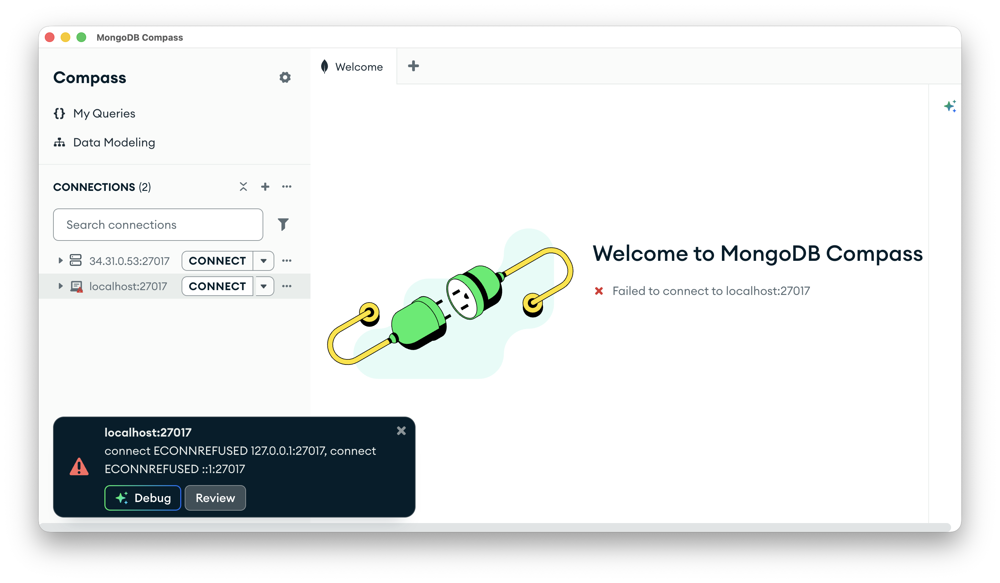

... it's not running. Fire up a terminal you don't mind having tied up and run

```bash
mongod --dbpath ~/data/mdata
```

or similar (depending on platform and where you created the mongo data folder).

You're good when you see:

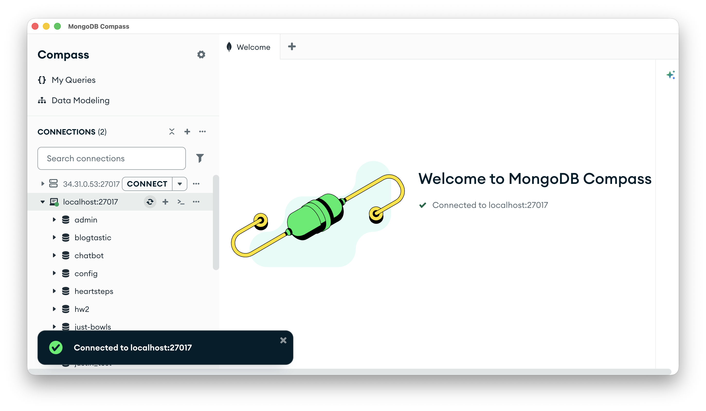

Now use  Compass to create a new database and collection:
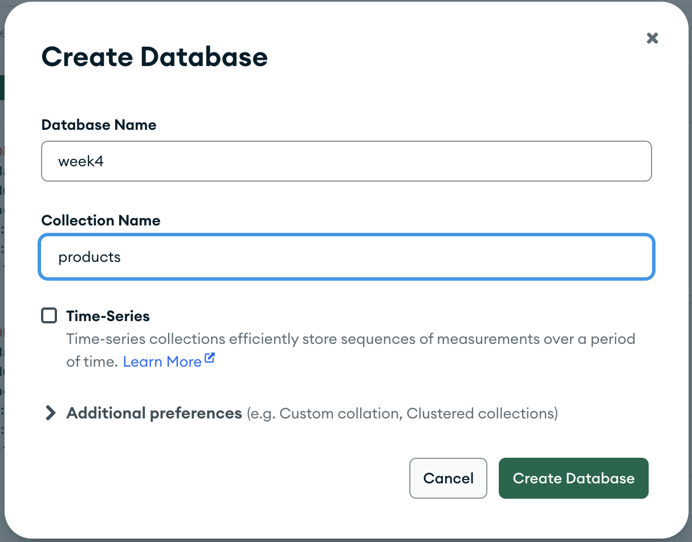

Now import some data to start. Use `sampleData/products.json` from your starter, importing it into the products collection.

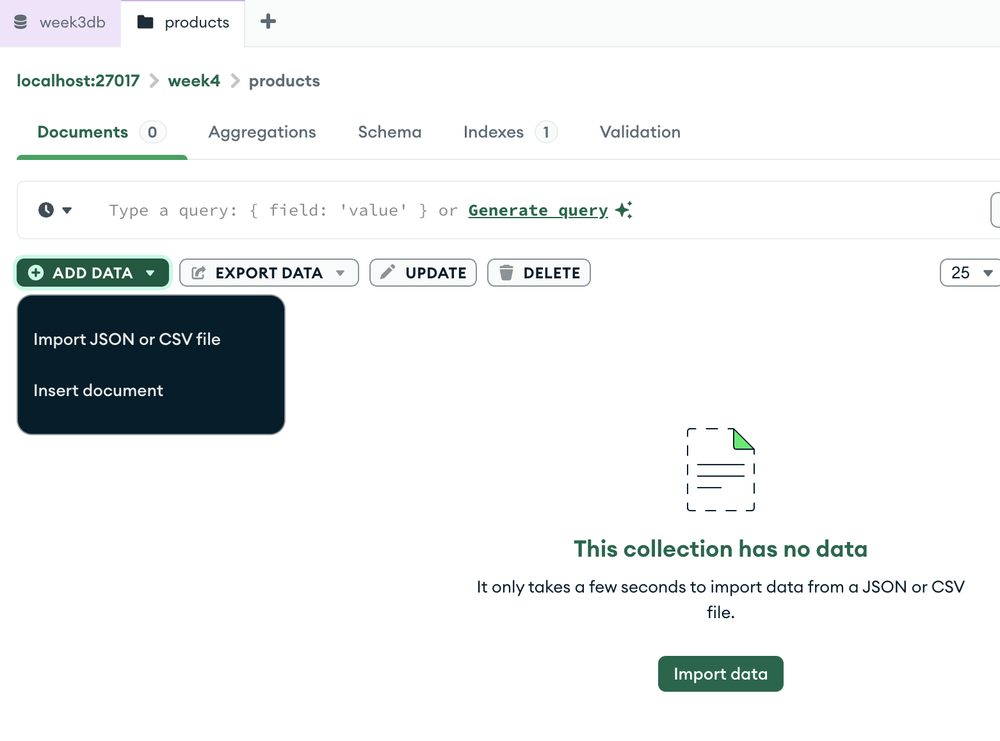

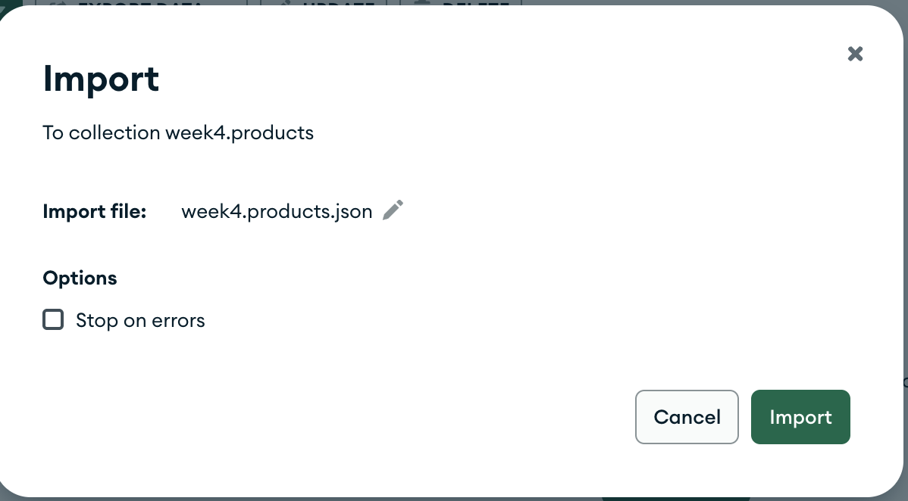

Once imported you should have two documents in your products collection.

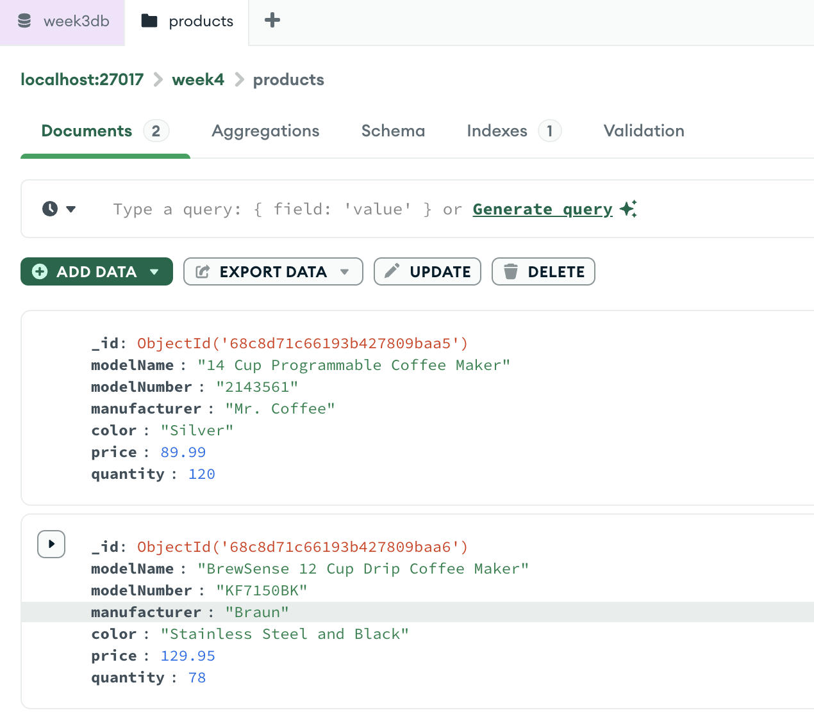

Now write code in `db/db.ts` to get the contents of the collection, applying what we discussed last week.

### Add DB operations

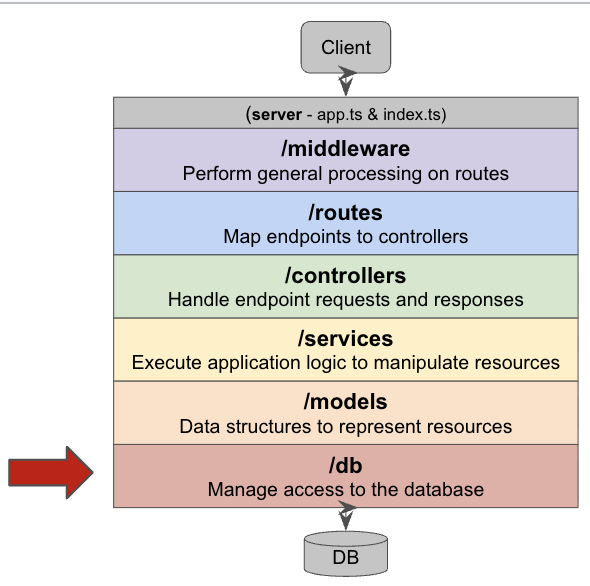

First the connection details and the collection name:

<<< ../../../code/week04-rest/week04-lecture/src/db/db.ts#config{ts}

Then `init()`, which connects, and `getAllInCollection()`, which reads. Note the guard: any function that touches the database calls `init()` first if the client isn't connected yet.

<<< ../../../code/week04-rest/week04-lecture/src/db/db.ts#init{ts}

<<< ../../../code/week04-rest/week04-lecture/src/db/db.ts#getAll{ts}

These are the first functions we've written with a declared return type on an `async` function so that might look a little funny. `Promise<void>` means "a promise of nothing", and `Promise<Document[]>` means "a promise of an array of Documents". An `async` function always hands back a promise, so its declared return type always has that wrapper around whatever it actually produces.

Finally, still in `db/db.ts`, export the pieces the layer above is allowed to use. (We'll add to this as we go.)

```ts
export const db = {
  init,
  getAllInCollection,
  PRODUCTS
};
```

### Add Model

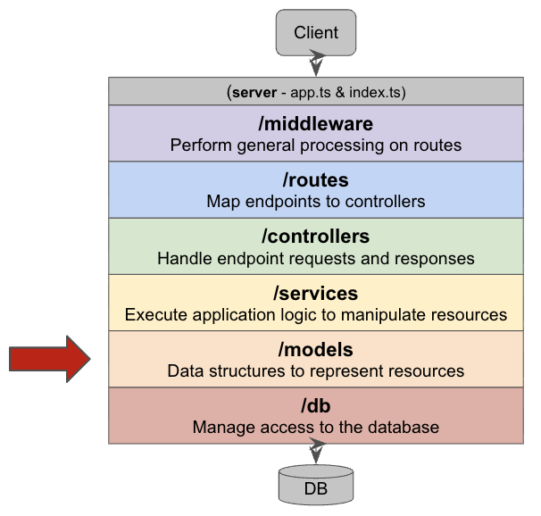

Next, in `models/product.ts`:

<<< ../../../code/week04-rest/week04-lecture/src/models/product.ts#product{ts}

The primary purpose of defining models as we've done here is to have a specification of what the objects in your system look like and what fields they have. This will keep you honest in your own code and provides the basis from which you will define "contracts" that govern the communication between your clients and your API.

The `Product` type is the specification of what a Product looks like for your API. Note that it is purely a compile-time thing (as are all TypeScript types and interfaces): it vanishes when the code runs. The function is what exists at runtime. `productFromDocument()` converts a Mongo document into a `Product`, and the only interesting line in it is the first one — `_id` (an `ObjectId`) becomes `id` (a string), so nothing above this layer has to know about ObjectId. A function like this is also where error checking and validation would go, though we aren't doing any of that here.

::: details Why `type` and not `interface`
In previous weeks, we alternated between defining types via `type` and via `interface`. There are subtle differences between them that mostly don't matter for what we're doing, but `type` provides a slightly cleaner syntax in some cases so that's what we're going to stick with going forward unless there's a good reason not to. You may still encounter `interface`s, though, as some libraries we are using (like Express) use interfaces (e.g., for `Request`) so you'll see them if you hover over a `Request` in your editor or if you look up docs.
:::

Note that this model does not import anything from any other part of the system — it serves purely as a data model declaration and object generator. Note too that `productFromDocument()` is a plain function: give it a document, get a product, with no database and no Express involved. Keep that in mind; it will matter when we start testing pieces in isolation.

### Add Service

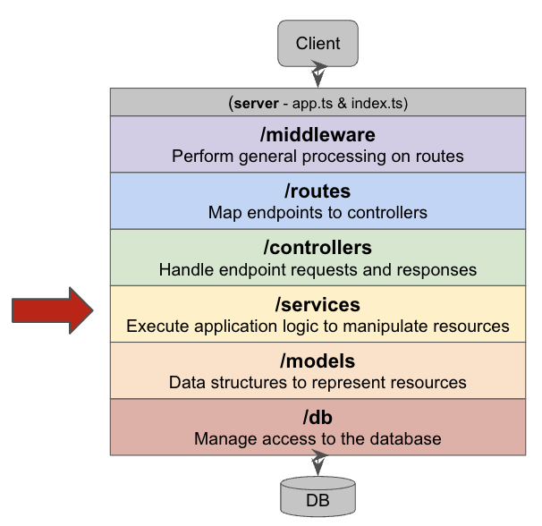

Now we can start to implement our `product` *service,* which will access the database via `db/db.ts` and (in this case) makes sure that mongo documents are transformed into application-specific data types (i.e., Product objects).

The following code will go into `services/product-service.ts`:

<<< ../../../code/week04-rest/week04-lecture/src/services/product-service.ts#imports{ts}

<<< ../../../code/week04-rest/week04-lecture/src/services/product-service.ts#getAll{ts}

```ts
export const productService = {
  getAll
};
```

Note that this service imports (and is therefore dependent on) the db and models layers, but knows nothing about controllers or routes.

### Add Controller

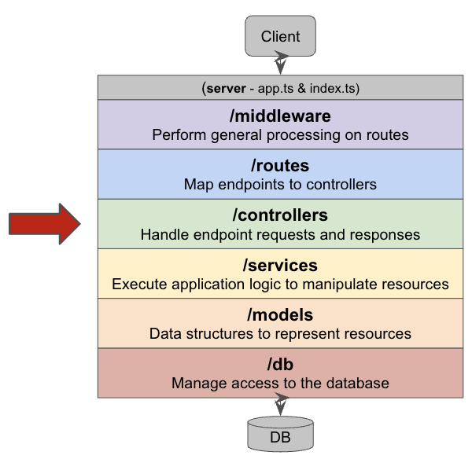

Controllers need to know about services (the layer below), but don’t know about routes (the layer above). They also don’t know about dbs (two layers below, encapsulated by the service layer). They *might* need to know about models, depending on how and where you insert validation, but for this example so far, they don't.

In `controllers/product-controllers.ts`:

<<< ../../../code/week04-rest/week04-lecture/src/controllers/product-controllers.ts#imports{ts}

<<< ../../../code/week04-rest/week04-lecture/src/controllers/product-controllers.ts#getProducts{ts}

```ts
export const productControllers = {
  getProducts
};
```

While the controller here doesn’t know about routes, per se, it does need to know about and handle the Express data types that represent HTTP requests and responses. In a nutshell, what this controller is doing is processing an HTTP GET request by invoking a service to get the requested data and sending the data as the response to the request.

### Add Route

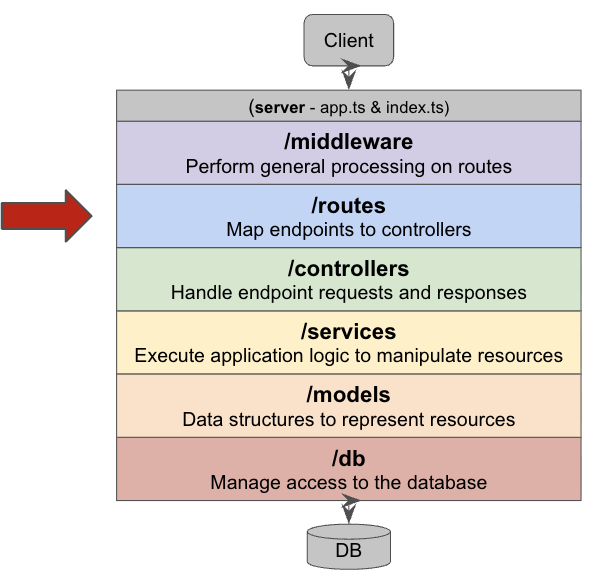

Since the controllers are doing the actual work of responding to requests, the only job of the `routes` is to map endpoints onto controller. In `routes/product-routes.ts`:

<<< ../../../code/week04-rest/week04-lecture/src/routes/product-routes.ts#setup{ts}

<<< ../../../code/week04-rest/week04-lecture/src/routes/product-routes.ts#get{ts}

### Add Middleware

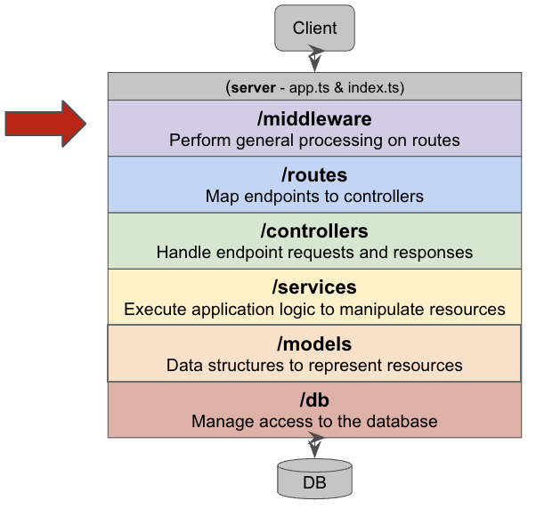

We’re almost ready to glue it all together, but need to add some middleware, if only for illustration. We'll add our fall-through error handler for unanticipated exceptions, in `middleware/error-handler.ts`:

<<< ../../../code/week04-rest/week04-lecture/src/middleware/error-handler.ts{ts}

### `app.ts` and `index.ts`

And finally we can glue it together and launch it. As in week 3 we separate the app logic from the setup and port listening into two files: `app.ts` builds the app and exports it, and `index.ts` inits the db and is the only file that opens a port. That split is what lets supertest drive the app without a running server.

In `app.ts`:

<<< ../../../code/week04-rest/week04-lecture/src/app.ts{ts}

Note that the error handler is registered **after** the routes. Express runs middleware in the order you register it, so an error handler added before the routes never sees anything they throw.

And in `index.ts`:

<<< ../../../code/week04-rest/week04-lecture/src/index.ts{ts}

This example shows all of the aforementioned layers and how they connect to each other.

Even in this relatively simple example, there are lots of decisions small and less small that need to be made and I don’t assert that they are all optimal (e.g., variable and function names, bundling of imports and exports, etc.).

### Try it in Postman

It's time to test our route. We'll first test using Postman. As we discussed last week, Postman is a simulated client designed to help you test your API as if a client were accessing it.

![The layer diagram of our app with its two clients. Across the top of the app, index.ts and app.ts sit side by side, joined by a dotted arrow; below them /middleware, /routes, /controllers, /services, /models and /db are stacked, and under /db is a database cylinder. On the left, two boxes — Postman (simulated client) and Client (e.g. React App) — share one arrow into index.ts, labelled HTTP :6790. At the bottom, two arrows meet the database cylinder and both are labelled mongo :27017: one from /db and one from a Compass box. Two conversations on two ports, and our app is the server in one and a client in the other.](images/stack-postman.png)

Start the server with `npm run dev` and send one request:

```text
GET http://localhost:6790/products
```


You should get back the two coffee makers you imported with Compass — which means the whole stack we just built works: the route found the controller, the controller asked the service, the service asked `db.ts`, and `db.ts` talked to Mongo.

## Build the `POST /products` route

Let’s build another route. Back to front, again. This time with less commentary, but definitely ask questions if you're not sure what's going on.

### Add DB operation

In `db/db.ts`:

<<< ../../../code/week04-rest/week04-lecture/src/db/db.ts#add{ts}

…and add it to the exports:

```ts
export const db = {
  init,
  getAllInCollection,
  addToCollection,
  PRODUCTS
};
```

FWIW the return type of `Promise<InsertOneResult>` leaks some Mongo knowledge up to the service layer. An argument could be made that a better approach would be to capture the `InsertOneResult` and re-package it into an app-specific return value (or return nothing on success and throw an error on anything but a successful result). But for this example we'll go ahead and pass the Mongo-typed result up the chain and let the service layer handle it.

### Add to the model

Reading products only ever needed one direction: document in, `Product` out.
Creating a product goes in the other direction — a caller hands us some fields, and any
of them might be missing. Add this to the bottom of `models/product.ts`:

<<< ../../../code/week04-rest/week04-lecture/src/models/product.ts#fields{ts}

:::tip Fancy syntax alert!
Two bits of syntax worth discussing here.

`ProductFields` is declared as `Partial<Product>`. `Partial<>` is a *utility
type*: give it a type and it hands back the same type with every field
optional, so we get the "some of the fields" shape for free instead of writing
the list out twice. Saying

```ts
export type ProductFields = Partial<Product>;
```

is the same as saying

```ts
export type ProductFields = {
  id?: string;
  modelName?: string;
  modelNumber?: string;
  manufacturer?: string;
  color?: string;
  price?: number;
  quantity?: number;
};
```

And this line

```ts
    modelName: fields.modelName ?? '',
```

uses the **nullish coalescing operator**, which gives you the left-hand
operand unless it is "nullish" (`null` or `undefined`), in which case you get
the right-hand one. So it reads: set `modelName` to `fields.modelName` if the
caller sent one, and to an empty string if they didn't.
:::

### Add to services

In `services/product-service.ts`:

<<< ../../../code/week04-rest/week04-lecture/src/services/product-service.ts#add{ts}

<<< ../../../code/week04-rest/week04-lecture/src/services/product-service.ts#exports{ts}

### Add to controllers

In `controllers/product-controllers.ts`:

<<< ../../../code/week04-rest/week04-lecture/src/controllers/product-controllers.ts#addProduct{ts}

<<< ../../../code/week04-rest/week04-lecture/src/controllers/product-controllers.ts#exports{ts}

### Add to routes

In `routes/product-routes.ts`:

<<< ../../../code/week04-rest/week04-lecture/src/routes/product-routes.ts#post{ts}

### Test in Postman

As you know, a POST takes more setting up than a GET did, because this time we are sending
something as well as asking for something.

**1. Make the request.** Add a new request to your Week 4 collection. Change
the method dropdown from GET to **POST**, and set the URL to:

```text
http://localhost:6790/products
```

**2. Give it a body.** Open the **Body** tab underneath the URL, choose
**raw**, and then change the type dropdown on the right of that row from
**Text** to **JSON**.

**3. Paste this in and hit Send:**

```json
{
  "modelName": "12-Cup Programmable Coffee Maker",
  "modelNumber": "MK-B-DCMzz1",
  "manufacturer": "REVOTRA",
  "color": "Silver/Black",
  "price": 44.77,
  "quantity": 312
}
```

You should get back **201 Created**, and a body containing nothing but an id:

```json
{
  "id": "6abbbe2bdc90e813eedeaeac"
}
```


Two things to notice about that response. The status is **201**, not 200,
because a resource was created — that is the controller's `res.status(201)`
doing its job. And the body is *only* the id, because the id is the one thing
the client could not have known already; it is generated by Mongo. Keep it handy (i.e., where it is now), you will want it for the Now You Try.

**4. Check that it actually worked**, two ways:

- `GET http://localhost:6790/products` now returns three products instead of
  two.

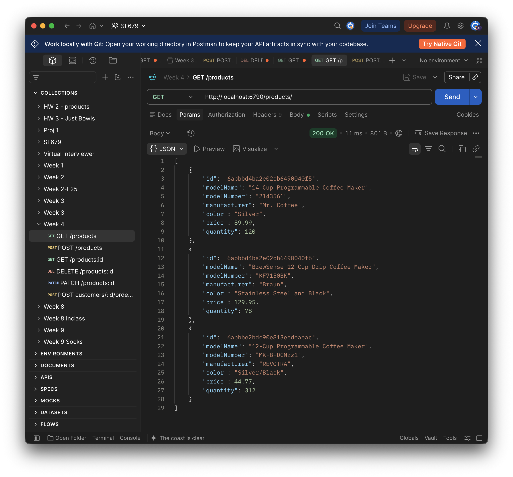

- Refresh week4's `products` in Compass and the REVOTRA is there.

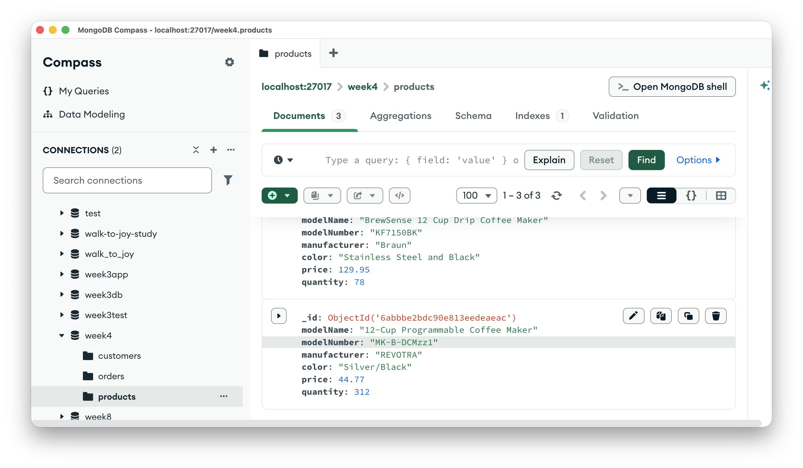

That last step is worth doing slowly, once. You are looking at the same
document twice: Compass calls its id `_id`, and our route calls it `id`,
because `productFromDocument()` renamed it on the way out. Nothing in the
app besides the db and model layers ever sees an `_id`.

::: warning When it doesn't work

- **Every field comes back empty or 0.** The Body type is still Text rather
  than JSON, or `app.use(express.json())` is missing from `app.ts`.
- **A page of HTML saying `Cannot POST /products`.** The request reached
  Express but no route matched it. Check that the method really is POST and
  that `productRouter.post('/', ...)` is in `product-routes.ts`.
- **`ECONNREFUSED`, or "could not send request".** Nothing is listening on
  6790 — `npm run dev` isn't running, or it crashed. Look at that terminal.
- **Nothing comes back for half a minute, then an error.** That is the Mongo
  driver waiting for a database that isn't there. Start `mongod`.
:::

## Now You Try #1

::: tip Lost? Catch up here
Copy the `src/` folder from the
[finished lecture code](https://github.com/SI679-public/SI679-public.github.io/tree/main/code/week04-rest/week04-lecture)
into your project, replacing yours, and start from there.
:::

### Build `GET /products/:id`

One product instead of all of them. Third trip down the stack, first one on
your own. Each piece is a small variation on something already in front of
you:

| Layer | What to add |
| --- | --- |
| `db` | find one document in a collection by its id |
| `models` | nothing — `productFromDocument()` already does this job |
| `services` | return one `Product` for a given id |
| `controllers` | read the id off the request, ask the service, respond |
| `routes` | map `GET /:id` to the new controller |

Two things here have not been discussed this week but were covered earlier. The first is `req.params`: whatever matches `:id` in the route pattern shows up there, always as a string.

The second is a decision. What should happen when the id isn't in the
database? `findOne()` hands back `null` rather than throwing, so nothing
crashes — but `200 OK` with a body of `null` is not a useful answer. **404**
is.

That decision is also where the layer boundary shows itself. `404` is an HTTP
idea, so only the controller may know about it; the service's job is to hand
back a product or nothing at all. **Look at your service's return type determine what it should be now.**

A few resources and notes:

- The [Mongo node driver CRUD docs](https://www.mongodb.com/docs/drivers/node/current/crud/) — the Read and Delete sections are the relevant ones.
- (From last week) Finding one document by its id looks like this. Note the conversion: the
  route gives you a string, Mongo wants an `ObjectId`.

```ts
const doc = await theDb
  .collection(collectionName)
  .findOne({ _id: new ObjectId(id) });
```

(`ObjectId` needs adding to the import at the top of `db.ts`.)

- You will need a real product id. Copy one out of Compass, or out of the
  response to a `POST /products`.

### Check it in Postman

There are no automated tests yet, so you are the test and Postman is the vehicle. Three things to confirm:

1. `GET /products/<an id you copied>` → **200**, and the body is a single
   product *object* — not an array with one thing in it.
2. `GET /products/aaaaaaaaaaaaaaaaaaaaaaaa` → **404**. Twenty-four hex
   characters: a perfectly well-formed Mongo id that is certainly not one of
   yours.
3. The id that comes back is `id`, a string. No `_id` anywhere in the
   response.

### Stretch: `DELETE /products/:id`

Same five layers, same 404 question, plus a new one: what does a *successful*
delete return? There is no single right answer, but valid choices include `200` with a body (e.g., `{status: success}`) versus [`204`](https://developer.mozilla.org/en-US/docs/Web/HTTP/Reference/Status/204) with no body.

Check it the same way. Delete one, then `GET /products` should be one shorter,
then refresh Compass and agree with yourself.

Lecture code with Now You Try solutions can be found [on GitHub](https://github.com/SI679-public/SI679-public.github.io/tree/main/code/week04-rest/week04-nyt-solution).
The routes are built across `src/db/db.ts`, `src/services/product-service.ts`,
`src/controllers/product-controllers.ts` and `src/routes/product-routes.ts`.

:::tip Announcements
Not much to announce. HW2 out next week, due a week after. HW3 will be released *during fall break* and due two weeks later--after the midterm assessments.

Hoping to get caught up on grading this week!
:::

## Test the routes with supertest

You just finished a list of things to check by hand: this status, that shape,
this field and not that one. Postman answered all of them. The trouble is that
the list does not go away — every change you make from here on, somebody has
to click Send again and read the response with their own eyes.

Supertest takes the human element out of it, which in this case is a good
thing. It sends the request, and `expect` reads the answer.

::: info Didn't finish the Now You Try?
It doesn't matter for this section. Everything below works against
`GET /products` and `POST /products`, which we built together — nothing here
depends on `GET /products/:id`.
:::

![The same layer diagram, redrawn for a test run. index.ts and app.ts are still side by side, but the dotted arrow between them is crossed out: index.ts never runs during a test. On the right is a Test Suite box with Supertest inside it, joined to app.ts by two arrows labelled sends requests and expects results — neither carries a port, because the request is handed straight to the app object. Below /db, a MongoMemoryServer cylinder stands where the database was, and a second line runs to it from the Test Suite, annotated: starts MMS, calls db.init() with the MMS URI and port, app thinks it's a real DB. Compass is nowhere in this picture.](images/stack-supertest.png)

As we saw last week, supertest also simulates a client, like Postman, but requires less supervision. You can define tests that involve multiple requests and programmatically verify that the responses are what you expect them to be.

We are going to start with the two requests we built together — `GET /products` and `POST /products` — written as tests.

### What changes, and what doesn't

The request and the response are the same as in Postman. Everything around
them is different:

| | Postman | Vitest / MongoMemoryServer / supertest |
| --- | --- | --- |
| **The server** | a real one, listening on port 6790, started by `npm run dev` | none. The request is handed straight to the `app` object, and no port is involved |
| **The database** | your real `week4` database — the one Compass is looking at | a throwaway MongoMemoryServer that appears when the run starts and vanishes when it ends |
| **The data** | whatever you imported, still there tomorrow | whatever the test put there a millisecond ago |
| **Who checks the answer** | you, reading JSON | `expect` |
| **When it runs** | when you click Send | every time you run `npm test` |

A few implications:

- Tests don't need `npm run dev` and they don't need Mongo running. Nothing is
  listening on a port. That is also why running the tests can't disturb the
  data you have been looking at in Compass.
- Nothing in `index.ts` is covered. supertest imports `app`, so the one file
  that opens a port and calls `db.init()` is never executed by the test suite.
  A missing `await db.init()` there would break the real server and every test
  would still pass. That is an argument for making the Postman check at least
  once, not for making it every time.

### A database only the test can see

Two of those rows deserve more than a table cell, starting with the database.

**MongoMemoryServer** is not a fake or a simulation. It is a real `mongod` —
the same program you start by hand for Compass — downloaded once and then
launched by the test run on a random free port, with its data kept in memory
instead of on disk. When the run ends, it is stopped and everything in it is
gone.

Three things follow from that, and all three are the point:

- **It starts empty, every time.** No leftovers from yesterday, nothing another
  test put there, nothing you imported in Compass. A test that needs data has
  to put it there, which means the test says out loud what it assumes.
- **Nothing else can reach it.** It is on a random port that only the test run
  knows, so Compass is not looking at it and your `npm run dev` server is not
  talking to it. Running the tests cannot disturb your `week4` database, and
  nothing you do in Compass can make a test pass or fail.
- **It disappears.** There is nothing to clean up afterwards and nothing to
  remember to reset.

That is the whole trade. Your real database is convenient and shared; this one
is inconvenient and yours alone, and being alone is what makes a result mean
something.

### Point the database somewhere else

There is one problem. `db.ts` has the connection URI and the database name
baked in as constants, so any code that imports it talks to your real `week4`
database. Tests need to be able to say "connect to *this* database instead" —
exactly what week 3's `connect(uri, dbName)` let us do.

Give `init()` two parameters with defaults. The app keeps calling `db.init()`
with no arguments and nothing about it changes; a test can call
`db.init(someOtherUri, 'test')`. In `db/db.ts`:

<<< ../../../code/week04-rest/week04-lecture/src/db/db.ts#init{ts}

We also need two functions that only tests will ever call: a way to hang up
the connection at the end of a run, and a way to empty a collection between
tests. Week 3 had both — `disconnect()` and `_clearProducts()`. Also in
`db/db.ts`:

<<< ../../../code/week04-rest/week04-lecture/src/db/db.ts#testSeams{ts}

`init` is already exported. Add the two new ones to the object at the bottom
of `db.ts`, leaving whatever else you have in there alone:

```ts
export const db = {
  // ...what's already here...
  disconnect,
  _clearCollection
};
```

### Set up the test

In `__tests__/products.test.ts`. This is very nearly week 3's setup: the
imports point at our new folders, and `db.init(...)` takes the place of
`connect(...)`. Everything else — start a MongoMemoryServer in `beforeAll`,
shut it down in `afterAll` — is the same.

<<< ../../../code/week04-rest/week04-lecture/src/__tests__/products.test.ts#setup{ts}

Four functions in there run *around* your tests rather than being tests
themselves. Week 3 met them in a hurry; here they are properly.

| Hook | Runs | Use it for |
|---|---|---|
| `beforeAll` | once, before the first test in the file | expensive setup: starting the database, connecting |
| `beforeEach` | before **every** test | putting the world into a known state |
| `afterEach` | after **every** test | undoing something a single test did |
| `afterAll` | once, after the last test in the file | shutting down: disconnecting, stopping the server |

The split between `beforeAll` and `beforeEach` is a judgement call about cost
versus isolation. Starting a MongoDB is slow, so we do it once. Emptying a
collection is fast, so we do it constantly. If we started a fresh database for
every test the suite would be perfectly isolated and unbearably slow; if we
seeded only once, test three would inherit whatever test two did, and a
failure would stop telling you where the bug is.

::: tip Why `afterAll` matters
Nothing dramatic happens if you forget it — Vitest will still finish. But the
memory server keeps running until the process exits, and on a bigger suite
you end up with several of them. Treat shutting down what you started as part
of starting it.
:::

### Put something in the database

Here is a difference from week 3. There, every test created its own data by
POSTing it, so `beforeEach` only had to *empty* the products collection. Our
`GET /products` route doesn't create anything, and a fresh MongoMemoryServer
starts out empty, so a test of GET has to put the products there itself.

We do that through the db layer rather than through the route, because the
thing under test is the route: if the test used `POST /products` to set up, a
bug in POST would make the GET test fail and you would go looking in the wrong
place. In `__tests__/products.test.ts`:

<<< ../../../code/week04-rest/week04-lecture/src/__tests__/products.test.ts#seed{ts}

Clear, then seed, before *every* test — so each test starts from the same two
products no matter what the test before it did.

### Check what comes back

The shape of a test: **arrange** (done for us by `beforeEach`), **act** (send
the request), **assert** (say what the answer should be). Still in
`__tests__/products.test.ts`:

<<< ../../../code/week04-rest/week04-lecture/src/__tests__/products.test.ts#listsWhatIsThere{ts}

Because the test put those two products there, it can be specific in a way a
Postman eyeball can't: exactly two of them, in that order, and definitely not
the REVOTRA one. That one test uses four matchers, so let's meet them.

::: info `toBe` — is it this exact value?
`expect(res.status).toBe(200)`

Use it for **primitives**: numbers, strings, booleans. It asks whether the two
things are the same value, the way `===` does.

Remember the word *primitive*. `toBe` on an object asks a different and much
less useful question, and we come back to that at the end of this section.
:::

::: info `toHaveLength` — how many?
`expect(res.body).toHaveLength(2)`

Works on anything with a `.length`: arrays, strings. `toHaveLength(2)` says
more than `expect(res.body.length).toBe(2)` says, and when it fails it tells
you what the length actually was.
:::

::: info `toEqual` — same contents?
`expect(manufacturers).toEqual(['Mr. Coffee', 'Braun'])`

This is the one for arrays and objects. It walks the whole structure and
compares it field by field, so two *different* arrays holding the same values
are equal. This is the matcher you want almost every time you are comparing
something bigger than a number.

Note it is order-sensitive for arrays: `['Braun', 'Mr. Coffee']` would fail.
That is on purpose here — our route returns products in insertion order, and
saying so pins the behaviour down.
:::

::: info `toContain` and `.not` — is it in there?
`expect(manufacturers).not.toContain('REVOTRA')`

`toContain` asks whether an array holds a value, or a string holds a
substring. Putting `.not` in front of any matcher inverts it.

Negative assertions are worth writing sparingly. "Doesn't contain REVOTRA"
passes for a thousand wrong reasons — including an empty array — so it is
useful next to a positive assertion and nearly worthless on its own.
:::

This next one checks something that only became true once we added the models
layer: the route hands out `id`, a string, and never Mongo's `_id`. If that
looks like a test of something that could not possibly go wrong, hold that
thought — we break it on purpose in a few minutes.

<<< ../../../code/week04-rest/week04-lecture/src/__tests__/products.test.ts#givesEachProductAnId{ts}

::: info `toMatch` — does it look like this?
`expect(product.id).toMatch(/^[0-9a-f]{24}$/)`

Takes a regular expression (or a substring) and asks whether the string
matches. We can't know what id Mongo will invent, but we know its *shape*:
twenty-four hexadecimal characters, start to end. Matching a shape rather than
a value is how you test something you don't control.
:::

::: info `toBeUndefined` — is it absent?
`expect(product._id).toBeUndefined()`

Exactly what it says. There is a family of these — `toBeNull`, `toBeDefined`,
`toBeTruthy` — and they are all more readable than comparing to a literal.

Asserting that something is *missing* feels odd until you remember what this
layer is for: `_id` not being here is the entire job of `productFromDocument()`.
:::

And POST, which is nearly the same test we wrote in week 3 — create, then read
back and confirm the new product is in the list:

<<< ../../../code/week04-rest/week04-lecture/src/__tests__/products.test.ts#post{ts}

Run them with `npm test`.

::: warning The first run is slow
The first `npm test` downloads a MongoDB binary for MongoMemoryServer to run,
which can take a minute or two. After that it's cached.
:::

```text
 Test Files  1 passed (1)
      Tests  3 passed (3)
```

Three tests, and between them they say more about `GET /products` than you
could check by hand in a minute — and they will say it again, unprompted,
every time you touch this code.

Green is also the least informative thing a test suite ever tells you. Next
week we spend real time on the other colour: how to read a failure, what the
different kinds of red mean, and why a passing test suite is not the same
thing as working software.

## Now You Try #2

::: tip Lost? Catch up here
Copy `src/__tests__/products.test.ts` from the
[finished lecture code](https://github.com/SI679-public/SI679-public.github.io/tree/main/code/week04-rest/week04-lecture)
into your project and start from there. If you didn't finish Now You Try #1,
take `src/` from that repo as well — you'll need the route you're about to
test.
:::

In Now You Try #1 you built `GET /products/:id` and checked it by hand. You
had a list: 200 and one object for an id that exists, 404 for one that
doesn't. Hand that list to the computer.

### Write the tests

Add a `describe('GET /products/:id')` block to `__tests__/products.test.ts`
with two tests in it:

1. **The product is there.** Status `200`, and the product that comes back is
   the one you asked for.
2. **The product isn't there.** Status `404`.

Two hints, which are really the same question — where does a test get an id?

- For the first test, ask a route you already trust. `GET /products` returns
  both seeded products, each with its `id`. Take one.
- For the second, you need an id that is **well-formed but absent**. Mongo ids
  are 24 hexadecimal characters, so `'a'.repeat(24)` is a perfectly valid id
  that is certainly not in your database.

Things worth knowing before you start:

- Your new tests get `beforeEach` for free. It runs before *every* test in the
  file, so the two seeded coffee makers are already there.
- Watch your matchers. Comparing a whole product object is `toEqual`, not
  `toBe`: `toBe` asks whether two things are the *same object*, which two
  objects holding identical data are not.

### Stretch: tests for `DELETE /products/:id`

If you built `DELETE` in Now You Try #1, test it: deleting a product leaves
one behind, and deleting an id that isn't there is a `404`.

The first of those is worth a moment. The interesting assertion is about a
*different request* than the one being tested — you delete, and then you ask
`GET /products` whether it worked. That is the first test we've written where
the check and the action are separate calls, and it is a pattern you'll use
constantly.

Lecture code with Now You Try solutions can be found [on GitHub](https://github.com/SI679-public/SI679-public.github.io/tree/main/code/week04-rest/week04-nyt-solution).
The tests are the last two `describe` blocks in
`src/__tests__/products.test.ts`.
